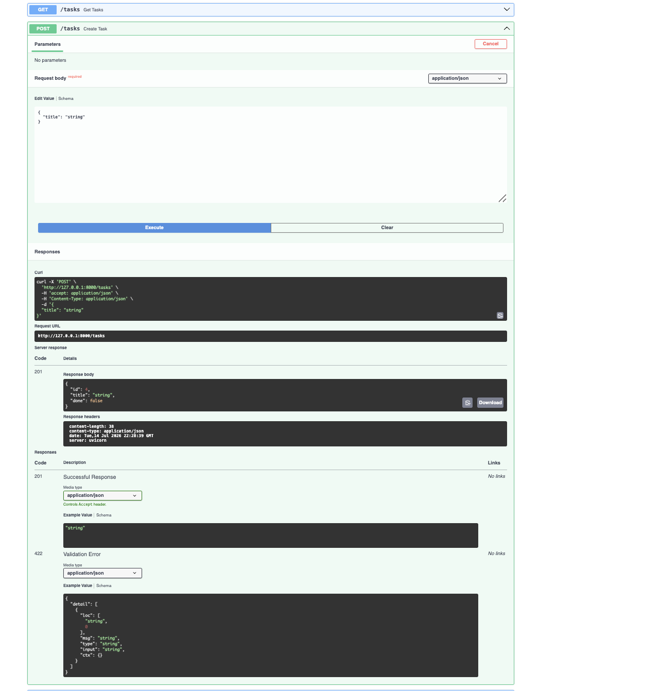

# Backend AI FastAPI 

## Week 2: CRUD Task API
A FastAPI backend managing a to-do list in memory — full Create, Read, Update, Delete. 

### How to run 
```bash
cd week2-crud-api
python3 -m venv venv
source venv/bin/activate
pip install fastapi uvicorn
uvicorn main:app --reload
```
Then visit `http://127.0.0.1:8000/docs` 

### Endpoints 

| Method | Path | Description |
|--------|------|-------------|
| GET | / | API info |
| GET | /health | Health check |
| GET | /tasks | List all tasks |
| GET | /tasks/{id} | Get one task (404 if not found) |
| POST | /tasks | Create a task (400 if title missing) |
| PUT | /tasks/{id} | Update a task (404 if not found) |
| DELETE | /tasks/{id} | Delete a task (204 on success) |

### Example request

```bash
curl -i -X POST http://127.0.0.1:8000/tasks -H "Content-Type: application/json" -d '{"title":"Buy milk"}'
```

Response:

```
HTTP/1.1 201 Created
{"id":4,"title":"Buy milk","done":false}
```

### Swagger UI



### Notes
Data is stored in memory only — restarting the server resets the task list back to the 3 default tasks. Persistent storage (a real database) comes in Week 3.
